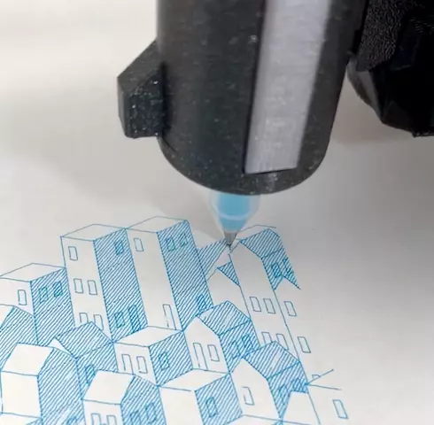

Plotting with the Prusa MK3S+
--------------------------------

Printing [Cubic Cityscape #1](https://plotterfiles.com/@reinder/files/6007e7e9-a35b-45d1-b313-adf74bf5977d) with a MUJI gel pen.

### Hardware
* Prusa MK3S+
* [Pen Plotter Attachment](https://www.printables.com/model/63385-pen-plotter-attachment-for-prusa-mk3s) - this is a great design, easy to switch pens, calibration tool for consistent z-height, mount does not interfere with regular printing

### Software
* Affinity Designer (can probably use Inkscape too)
* python 3
* `pip install vpype`
* `pip install vpype-gcode`

### Calibrate
[Calibrating](docs/calibrating.md)

### Workflow
1. Layout the SVG
	1. Open the SVG in Affinity Designer -> select all -> copy
	2. Affinity Designer -> New -> Print
	  * width/height: yuor plottable area (e.g. 207 x 172 mm)
		* units: millimeters
		* dpi: 96 (vpype assumes 96 dpi)
	3. Paste the SVG
	3. If modifying the SVG or have multiple object, group the vector layers together (Layer toolbox -> select all -> right-click Group). vpype will optimize paths within a layer.
	4. Export -> SVG
	  * Use DPI: 96 (under More)
		* Flatten Transforms checked (under More)
		* Export Text as Curves checked (under More)
		* Set Viewbox (under More)
2. `./plot.sh myfile.svg`
3. Print
	1. Place paper on smooth sheet
	2. Secure with magnets, tape or binder clips
		* Place these on the front, right edge (on the Prusa logo) and on the back left edge
		* If you are using something short to secure, you can get away with anywhere along top & bottom edges
	4. Print `myfile.gcode`
